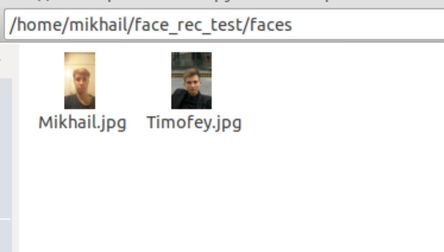
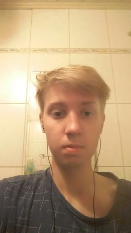
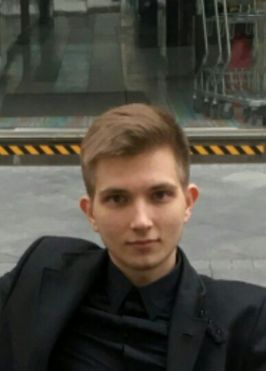
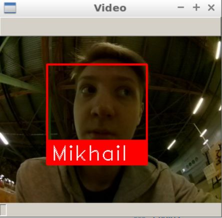
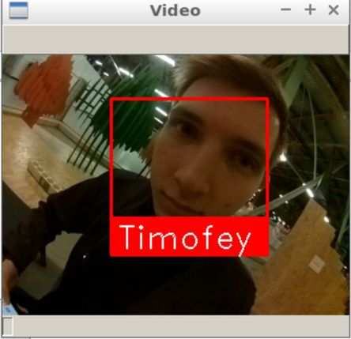
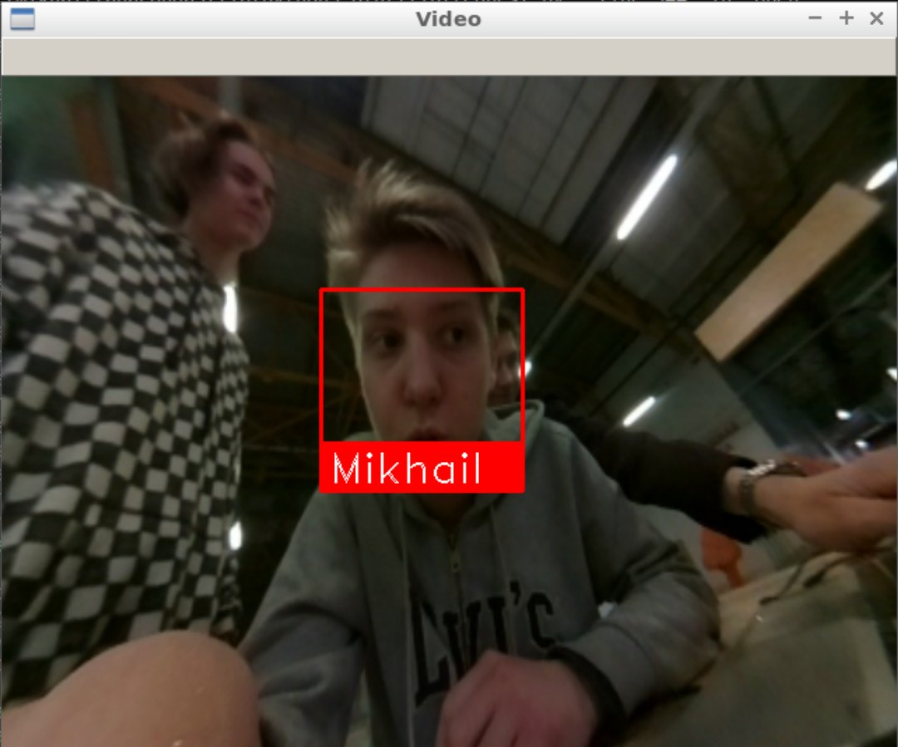
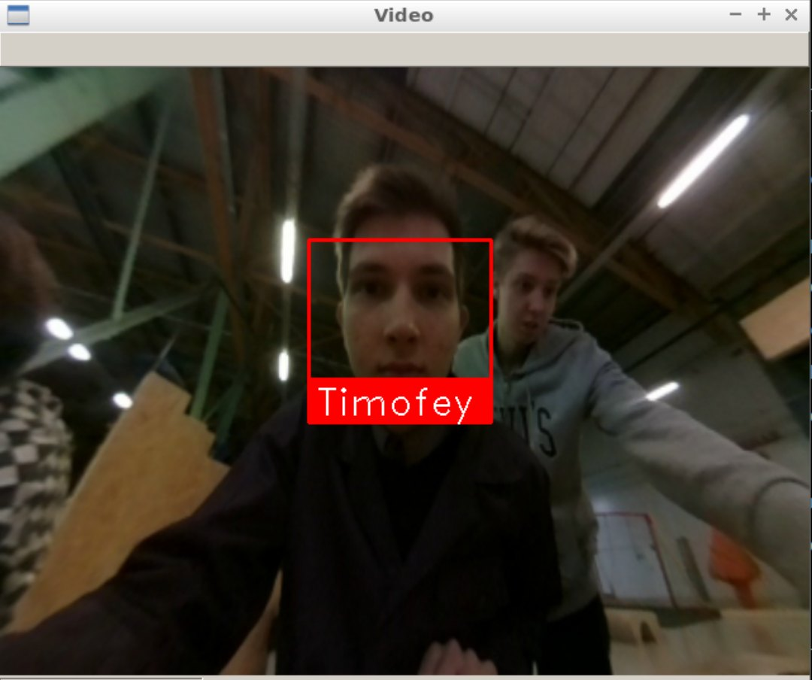

# Facial recognition system

## Introduction

Facial recognition systems are increasingly being used in recent years, and the scope of application of this technology is truly vast, ranging from selfie-drones to drones and police drones. It is integrated into a variety of devices everywhere. The recognition process itself is really fascinating, and that's what made me do this project.  The goal of my intern project is to create a simple open source facial recognition system from the "Clover 3" quadcopter. This program takes images from the camera of the quadcopter, and its processing takes place on the computer. Therefore, all the remaining instructions are executed on the PC.

## Development

The first task was to find the algorithm of the recognition itself. As a way to solve the problem, I chosed to use [a ready-made API for Python](https://github.com/ageitgey/face_recognition). This API combines a number of advantages: speed and accuracy of recognition, as well as ease of use.

## Installation

Firstly you need to install all the necessary libraries:

```bash
pip install face_recognition
pip install opencv-python
```

Then download the script from the repository:

```bash
git clone https://github.com/mmkuznecov/face_recognition_from_clever.git
```

## Code explanation

Import libraries:

```python
import face_recognition
import cv2
import os
import urllib.request
import numpy as np
```

***This piece of code is intended for Python 3. In Python 2.7 we use urllib2 instead of urllib:***

```python
import urllib2
```

Create a list of image encodings and a list of names:

```python
faces_images=[]
for i in os.listdir('faces/'):
    faces_images.append(face_recognition.load_image_file('faces/'+i))
known_face_encodings=[]
for i in faces_images:
    known_face_encodings.append(face_recognition.face_encodings(i)[0])
known_face_names=[]url
for i in os.listdir('faces/'):
    i=i.split('.')[0]
    known_face_names.append(i)
```

***Advanced: all images are stored in the /faces folder in the format name.jpg***







Initialize some variables:

```python
face_locations = []
face_encodings = []
face_names = []
process_this_frame = True
```

Take the image from the server and convert it to cv2 format:

```python
req = urllib.request.urlopen('http://192.168.11.1:8080/snapshot?topic=/main_camera/image_raw')
arr = np.asarray(bytearray(req.read()), dtype=np.uint8)
frame = cv2.imdecode(arr, -1)
```

***For Python 2.7:***

```python
req = urllib2.urlopen('http://192.168.11.1:8080/snapshot?topic=/main_camera/image_raw')
arr = np.asarray(bytearray(req.read()), dtype=np.uint8)
frame = cv2.imdecode(arr, -1)
```

Explanation of further code can be found on the github of the API in the comments to [the next script](https://github.com/ageitgey/face_recognition/blob/master/examples/facerec_from_webcam_faster.py)

## Usage

Just connect to the "Clover" via Wi-Fi and check if the video stream from the camera works correctly.

Then just run the script:

```bash
python recog.py
```

And on the output:





## Possible difficulties

The following error may occur during the work of the script:

```python
    known_face_encodings.append(face_recognition.face_encodings(i)[0])
IndexError: list index out of range
```

In this case, try to remake the photos in the faces folder, perhaps due to poor quality the program does not recognize faces in the images.

## Using the calibration

You can use the camera's calibration to increase the accuracy of recognition. The calibration module can be installed using the [special package](https://github.com/tinderad/clever_cam_calibration). Instructions for the installation and using can be found in the calibration.md file. The program using the calibration package is called recog_undist.py

**Brief explanation of the code:**

Import the installed package:

```python
import clever_cam_calibration.clevercamcalib as ccc
```

Add the following lines:

```python
height_or, width_or, depth_or = frame.shape
```

Thus we get information about the size of the image, where height_or is the height of the original image in pixels, and width_or is the width.
Then we correct distortions of the original image and get its parameters:

```python
frame=ccc.get_undistorted_image(frame,ccc.CLEVER_FISHEYE_CAM_640)
height_unz, width_unz, depth_unz = frame.shape
```

***In this case, we pass the argument CLEVER_FISHEYE_CAM_640, because the image resolution in the example is 640x480, you can also use the argument CLEVER_FISHEYE_CAM_320 for the resolution of 320x240, otherwise you need to pass the path to the calibration .yaml file as a second argument.***

And finally, we return the image to its original size:

```python
frame=cv2.resize(frame,(0,0), fx=(width_or/width_unz),fy=(height_or/height_unz))
```

Thanks to it it is possible to raise accuracy of recognition considerably as the processed image will be not so much distorted any more.



